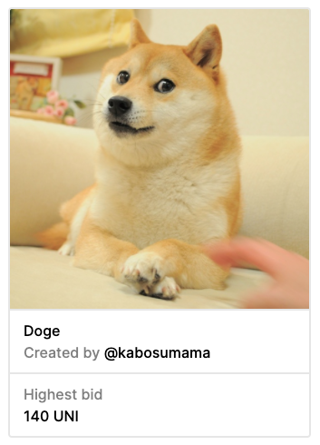
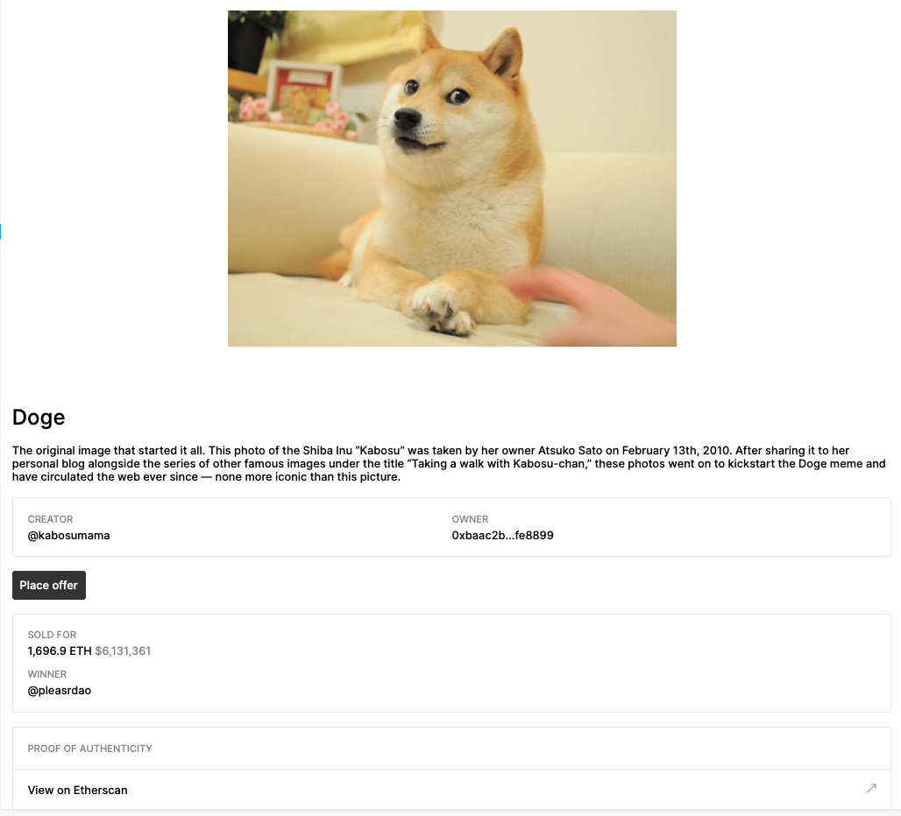

import Tabs from '@theme/Tabs'
import TabItem from '@theme/TabItem'

##### Tools for displaying NFTs

---

DIGI provides multiple tools for making it easy to display NFTs.

##### Displaying Options
- [NFT Iframe:](./introduction#nft-iframe) Embed NFTs into your own website
- [NFT Components:](./introduction#nft-components) React components that can be used to render NFT content

NFT Components assumes a `React` frontend.

---


## NFT Iframe 
Embed any NFT shown on [digiv3rse.xyz](https://digiv3rse.xyz/) into your own website. All iframes are mobile responsive and are compatible with text, images, videos, and audio.

You can generate an iframe by entering in the [digiv3rse.xyz URL](https://digiv3rse.xyz/collections/digi/5846) for the NFT that you would like to display at [embed.digiv3rse.xyz](https://embed.digiv3rse.xyz/).

<iframe src="https://embed.digiv3rse.xyz/0xabEFBc9fD2F806065b4f3C237d4b59D9A97Bcac7/5846?title=false&controls=false&loop=false&autoplay=false"
  width="325" 
  height="325" 
  scrolling="no" 
  allowtransparency="true" 
  allowfullscreen="true" 
  sandbox="allow-pointer-lock allow-same-origin allow-scripts allow-popups">
</iframe>
    
<br/>
<br/>

```html
<div style="max-width: 960px; margin: 0 auto; position: relative;">
  <style>.nft-embed-wrapper > iframe {width: 100%!important; height:100%!important; border: 0; position: absolute; top: 0; left: 0;}</style>
  <div class="nft-embed-wrapper" style="position: relative; width:100%; height:0; padding-bottom: 100%;">
    <iframe 
      src="https://embed.digiv3rse.xyz/0xabEFBc9fD2F806065b4f3C237d4b59D9A97Bcac7/5846?title=false&controls=false&loop=false&autoplay=false" width="100%" 
      height="100%" 
      scrolling="no" 
      allowtransparency="true" 
      allowfullscreen="true" 
      sandbox="allow-pointer-lock allow-same-origin allow-scripts allow-popups">
    </iframe>
  <div>
</div>
```

---

## NFT Components

This library is made up of `React` components that can be used to render ERC-721 NFTs.
Default styling and fetching URLs are included with the library along with caching mechanisms and the ability to easily customize strings, render components, and add different styling.

Links direct to DIGI.xyz interfaces, but can be overridden by building out the functionality with the [DDK](../../../docs/developer-tools/ddk/introduction).

[**View Components Storybook Documentation ->**](https://digiv3rse.github.io/nft-components/?path=/story/introduction--page)

<Tabs
  defaultValue="yarn"
  values={[
    { label: 'Yarn', value: 'yarn', },
    { label: 'NPM', value: 'npm', }
  ]
}>
<TabItem value="yarn">

```bash
yarn add @digiv3rse/nft-components
```

</TabItem>
<TabItem value="npm">

```bash
npm install @digiv3rse/nft-components --save
```

</TabItem>
</Tabs>

##### NFT Preview Component



##### NFT Full Page Component




